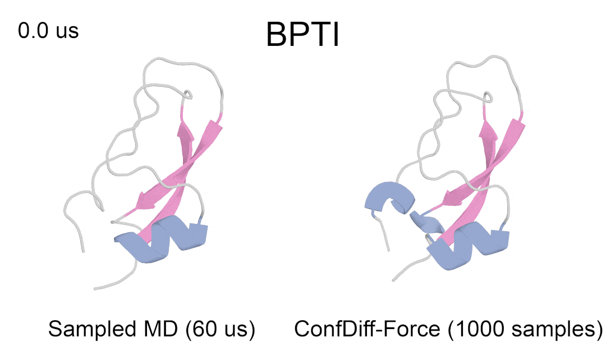

<div align="center">

# Official Implemetation of ConfDiff (ICML'24) - Protein Conformation Generation via Force-Guided SE(3) Diffusion Models

<a href="https://pytorch.org/get-started/locally/"></a>
<a href="https://pytorchlightning.ai/"></a>
<a href="https://hydra.cc/"></a>
<a href="https://github.com/ashleve/lightning-hydra-template"></a><br>
</div>


<!-- <div align="center">
    
</div> -->
The repository is the official implementation of the ICML24 paper [Protein Conformation Generation via Force-Guided SE(3) Diffusion Models](https://arxiv.org/abs/2403.14088), which introduces ConfDiff, a force-guided SE(3) diffusion model for protein conformation generation. ConfDiff can generate protein conformations with rich diversity while preserving high fidelity. Physics-based energy and force guidance strategies effectively guide the diffusion sampler to generate low-energy conformations that better align with the underlying Boltzmann distribution. 


<!-- Based on the protein backbone model from ICML, we extend the model to a **full-atom model** by incorporating side-chain predictions (no need for packing side-chains when calculating energy). Additionally, we also include the test results on ATLAS dataset. -->
With recent progress in protein conformation prediction, we extend ConfDiff to ConfDiff-FullAtom, diffusion models for full-atom protein conformation prediction. Current models include the following updates:
  - Integrated a regression module to predict atomic coordinates for side-chain heavy atoms
  - Provided models options with four folding model representations (ESMFold or OpenFold with recycling number of 0 and 3)
  - Used all feature outputs from the folding model (node + edge) for diffusion model training.
  - Released a version of sequence-conditional models fine-tuned on the [Atlas](https://www.dsimb.inserm.fr/ATLAS/index.html) MD dataset.

<!-- <div align="center">
    
</div> -->
<div align="center">
    
</div>


## Installation
```bash
# clone project
git clone https://url/to/this/repo/ConfDiff.git
cd ConfDiff

# create conda virtual environment
conda env create -f env.yml
conda activate confdiff

# install openfold
git clone https://github.com/aqlaboratory/openfold.git
pip install -e openfold
```
## Pretrained Representation
We precompute ESMFold and OpenFold representations as inputs to the model. The detailed generation pipline can be referenced in the `README` of the `pretrained_repr/` folder.

## ConfDiff-BASE
ConfDiff-BASE employs a **sequence-based conditional score network** to guide an **unconditional score model** using classifier-free guidance, enabling diverse conformation sampling while ensuring structural fidelity to the input sequence.

### Prepare datasets
We train **Confdiff-BASE** using the protein structures from [Protein Data Bank](https://www.rcsb.org/), and evaluate on various datasets including fast-folding, bpti, apo-holo and atlas.
Details on dataset prepration and evaluation can be found in the `dataset` folder.

The following datasets and pre-computed representations are required to train **Confdiff-BASE**:
1. RCSB PDB dataset: See `dataset/rcsb` for details. Once prepared, specify the `csv_path` and `pdb_dir` in the configuration file `configs/paths/default.yaml`.
1. ESMFold or OpenFold representations: See `pretrained_repr` for details. Once prepared, specify the `data_root` of `esmfold_repr`/`openfold_repr` in the configuration file `configs/paths/default.yaml`.


### Training
ConfDiff-BASE consists of a **sequence-conditional model** and an **unconditional model**.


To train the **conditional model**:
```bash
python3 src/train.py \
        task_name=cond \
        experiment=full_atom \
        data/dataset=rcsb \
        data/repr_loader=openfold \
        data.repr_loader.num_recycles=3 \
        data.train_batch_size=4
```
The detailed training configuration can be found in `configs/experiment/full_atom.yaml`.

To train the **unconditonal model**:
```bash
python3 src/train.py \
        task_name=uncond \
        experiment=uncond_model \
        data/dataset=rcsb \
        data.train_batch_size=4 
```
The detailed training configuration can be found in `configs/experiment/uncond.yaml`.

### Model Checkpoints
Access pretrained models with different pretrained representations:

| **Model name**     | **Repr type** | **Num of Recycles** |
|--------------------|---------------|---------------------|
| [ConfDiff-ESM-r0-COND](https://huggingface.co/leowang17/ConfDiff/tree/main/ConfDiff-BASE) | ESMFold       | 0                   |
| [ConfDiff-ESM-r3-COND](https://huggingface.co/leowang17/ConfDiff/tree/main/ConfDiff-BASE) | ESMFold       | 3                   |
| [ConfDiff-OF-r0-COND](https://huggingface.co/leowang17/ConfDiff/tree/main/ConfDiff-BASE)  | OpenFold      | 0                   |
| [ConfDiff-OF-r3-COND](https://huggingface.co/leowang17/ConfDiff/tree/main/ConfDiff-BASE)  | OpenFold      | 3                   |
| [ConfDiff-UNCOND](https://huggingface.co/leowang17/ConfDiff/tree/main/ConfDiff-BASE)  |   /  |           /        |

<!-- The results of ConfDiff-BASE with different pretrained representations are shown in the table below. -->


### Inference
To sample conformations using the ConfDiff-BASE model:
```bash
#Please note that the model and representation need to be compatible.
python3 src/eval.py \
        task_name=eval_base_bpti \
        experiment=clsfree_guide \
        data/repr_loader=openfold \
        data.repr_loader.num_recycles=3 \
        paths.guidance.cond_ckpt=/path/to/your/cond_model \
        paths.guidance.uncond_ckpt=/path/to/your/uncond_model \
        data.dataset.test_gen_dataset.csv_path=/path/to/your/testset_csv \
        data.dataset.test_gen_dataset.num_samples=1000 \
        data.gen_batch_size=20 \
        model.score_network.cfg.clsfree_guidance_strength=0.8
```

## ConfDiff-FORCE/ENERGY 

By utilizing prior information from the MD force field, our model effectively reweights the generated conformations to ensure they better adhere to the equilibrium distribution

### Data

Protein conformations with force or energy labels are required to train the corresponding ConfDiff-FORCE or ConfDiff-ENERGY. 
We use [OpenMM](https://openmm.org/) for energy and force evaluation of the conformation samples generated by ConfDiff-BASE

To evaluate force and energy labels using OpenMM and prepare the training data:

```bash
python3 src/utils/protein/openmm_energy.py \
                --input-root /path/to/your/generated/samples \
                --output-root /path/to/your/output_dir \
```

The output directory `/path/to/your/output_dir` contains force annotation files (with the suffix *force.npy), optimized energy PDB files, and train and validation CSV files with energy labels.

### Training
Before training, please ensure that the pretrained representations for the training proteins have been prepared.

To train ConfDiff-FORCE:

```bash
# case for training ConfDiff-FORCE
python3 src/train.py \
        experiment=force_guide \
        data/repr_loader=esmfold \
        data.repr_loader.num_recycles=3 \
        paths.guidance.cond_ckpt=/path/to/your/cond_model \
        paths.guidance.uncond_ckpt=/path/to/your/uncond_model \
        paths.guidance.train_csv=/path/to/your/output_dir/train.csv \
        paths.guidance.val_csv=/path/to/your/output_dir/val.csv \
        paths.guidance.pdb_dir=/path/to/your/output_dir/ \
        data.train_batch_size=4 
```

Similarly, the ConfDiff-ENERGY model can be trained by setting `experiment=energy_guide`. 
Detailed training configurations can be found in the file `configs/experiment/force_guide(energy_guide).yaml`.


### Model Checkpoints
Access pretrained ConfDiff-FORCE/ENERGY with `ESMFold` representations on different datasets.

| Model name| dataset | Repr type | Num of Recycles | 
| --------- | --------------- | --------------- | --------------- | 
| [ConfDiff-ESM-r0-FORCE](https://huggingface.co/leowang17/ConfDiff/tree/main/ConfDiff-GUIDANCE) | fast-folding | ESMFold| 0 |
| [ConfDiff-ESM-r0-ENERGY](https://huggingface.co/leowang17/ConfDiff/tree/main/ConfDiff-GUIDANCE) | fast-folding | ESMFold| 0 |
| [ConfDiff-ESM-r3-FORCE](https://huggingface.co/leowang17/ConfDiff/tree/main/ConfDiff-GUIDANCE) | bpti |ESMFold| 3 |
| [ConfDiff-ESM-r3-ENERGY](https://huggingface.co/leowang17/ConfDiff/tree/main/ConfDiff-GUIDANCE) | bpti | ESMFold| 3 |

We found that using only the node representation's on the **fast-folding** dataset yields better results. To train models with only node representation, set `data.repr_loader.edge_size=0`

### Inference
To sample conformations using the ConfDiff-FORCE/ENERGY model:

```bash
# case for generating samples by ConfDiff-FORCE
python3 src/eval.py \
        task_name=eval_force \
        experiment=force_guide \
        data/repr_loader=esmfold \
        data.repr_loader.num_recycles=3 \
        ckpt_path=/path/to/your/model/ckpt/ \
        data.dataset.test_gen_dataset.csv_path=/path/to/your/testset_csv \
        data.dataset.test_gen_dataset.num_samples=1000 \
        data.gen_batch_size=20 \
        model.score_network.cfg.clsfree_guidance_strength=0.8 \
        model.score_network.cfg.force_guidance_strength=1.0
        # data.repr_loader.edge_size=0 for pretrained checkpoints on fast-folding
```


## Fine-tuning On ATLAS


See `datasets/atlas` for ATLAS data preparation.

To fine-tune ConfDiff-BASE on ATLAS.
```bash
#Training
python3 src/train.py \
        task_name=finetune_atlas \
        experiment=full_atom \
        data/dataset=atlas \
        data/repr_loader=esmfold \
        ckpt_path=/path/to/your/cond_model

#Evaluation
python3 src/eval.py \
        task_name=eval_atlas \
        experiment=full_atom \
        data/dataset=atlas \
        data.dataset.test_gen_dataset.csv_path=/path/to/your/testset_csv \
        data.dataset.test_gen_dataset.num_samples=1000 \
        data.gen_batch_size=20 \
        ckpt_path=/path/to/your/atlas_model
```
The models fine-tuned on ATLAS MD dataset is shown in the table below:

| Model name | Repr type | Num of Recycles | 
| ------------------------------------------------------------ | ---------------|----------------------------------------------|
| [ConfDiff-ESM-r3-MD](https://huggingface.co/leowang17/ConfDiff/tree/main/ConfDiff-MD) | ESMFold | 3 |
| [ConfDiff-OF-r3-MD](https://huggingface.co/leowang17/ConfDiff/tree/main/ConfDiff-MD) | OpenFold |3   |


## Performance

We benchmark model performance on following datasets: BPTI, fast-folding, Apo-holo, and Atlas. Evaluation details can be found in the `datasets` folder and the notebook `notebooks/analysis.ipynb`.


ConfDiff-XXX-ClsFree refers to the ConfDiff-BASE model utilizing classifier-free guidance sampling with the ConfDiff-XXX-COND and ConfDiff-UNCOND models. As described in the paper, all results are based on ensemble sampling with varying levels of classifier-guidance strength. For the fast-folding dataset, the classifier-guidance strength values range from 0.5 to 1.0, while for other datasets, the range is 0.8 to 1.0. For BPTI and fast-folding, we also provide results from the pretrained FORCE and ENERGY models.

### BPTI
|  | **RMSDens** | **pwRMSD** | **min_RMSD_ref3** |  **CA-Break Rate %** | **PepBond-Break Rate %** |
|--------------------------|-------------|------------|-------------------|---------------------|---------------------|
| ConfDiff-ESM-r3-ClsFree | 1.39        | 1.80       | 2.32              | 0.5                 | 7.5                      |
| ConfDiff-ESM-r3-Energy  | 1.41        | 1.22       | 2.39              | 0.1                 |7.5                      |
| ConfDiff-ESM-r3-Force   | 1.34        | 1.76       | 2.18              | 0.1                 | 8.9                      |

The guidance strength is set to 1.5 for the FORCE model and 1.0 for the ENERGY model.

<div align="center">
    
</div>


### Fast-Folding

|              | **JS-PwD** | **JS-Rg** | **JS-TIC** | **JS-TIC2D** | **Val-Clash (CA)** |
|------------------------|------------|-----------|------------|--------------|--------------------|
| ConfDiff-ESM-r0-ClsFree| 0.32/0.32  | 0.29/0.30 | 0.37/0.38  | 0.54/0.52    | 0.903/0.935        |
| ConfDiff-ESM-r0-Energy | 0.39/0.40  | 0.37/0.36 | 0.41/0.43  | 0.58/0.58    | 0.991/0.994        |
| ConfDiff-ESM-r0-Force  | 0.34/0.33  | 0.31/0.30 | 0.40/0.44  | 0.58/0.60    | 0.975/0.982        |

The models here utilize only the pretrained node representation. The force guidance strength is set to 2.0 for the FORCE model and 1.0 for the ENERGY model.

### Apo-Holo
|                    | **Best ref1 TMscore** | **Best ref2 TMscore** | **TMens**   | **TMmin**   | **pwTMscore** | **CA-Clash Rate %** |   **PepBond-Break Rate %** |
|--------------------------|-----------------------|-----------------------|-------------|-------------|---------------|---------------------|--------------------------|
| ConfDiff-ESM-r3-MD          | 0.836/0.877           | 0.862/0.908           | 0.849/0.892 | 0.814/0.862 | 0.846/0.875   | 0.3/0.2             |  4.1/4.0                  |
| ConfDiff-OF-r3-MD          | 0.839/0.881           | 0.874/0.918           | 0.857/0.890 | 0.821/0.865 | 0.863/0.892   | 0.4/0.2             |  6.8/6.8                  |
| ConfDiff-ESM-r3-ClsFree | 0.837/0.883           | 0.864/0.907           | 0.850/0.887 | 0.814/0.862 | 0.846/0.869   | 0.7/0.6             |  4.6/4.5                  |
| ConfDiff-OF-r3-ClsFree | 0.838/0.886           | 0.879/0.927           | 0.859/0.885 | 0.819/0.860 | 0.870/0.898   | 0.8/0.6             |  5.8/5.6                  |


### ATLAS
| |**Pairwise RMSD**|**Pairwise RMSD r**|**RMSF**|**Global RMSF r**|**Per target RMSF r**|**RMWD**|**RMWD trans**|**RMWD var**|**MD PCA W2**|**Joint PCA W2**|**PC sim > 0.5 %**|**Weak contacts J**|**Transient contacts J**|**Exposed residue J**|**Exposed MI matrix rho**|**Val-Clash (CA)**|**Val-Break (CA)**|**CA-Clash Rate %**|**PepBond-Break Rate %**|**Secondary Structure %**|**Strand %**|
|:----|:----|:----|:----|:----|:----|:----|:----|:----|:----|:----|:----|:----|:----|:----|:----|:----|:----|:----|:----|:----|:----|
|ConfDiff-ESM-r3-COND|3.42|0.29|2.06|0.4|0.8|3.67|3.326056|1.486459|1.7|3.17|34.1|0.48|0.31|0.42|0.18|0.533/0.594|0.996/1.000|1.6|3.9|60.3|17.2|
|ConfDiff-ESM-r3-MD|3.91|0.35|2.79|0.48|0.82|3.67|3.052409|1.512934|1.66|2.89|39|0.56|0.34|0.48|0.23|0.584/0.654|0.997/1.000|1.5|4|59.4|16.9|
|ConfDiff-OF-r3-COND|2.9|0.38|1.43|0.51|0.82|2.97|2.4588|1.515518|1.57|2.51|34.1|0.47|0.34|0.43|0.18|0.567/0.718|0.994/1.000|0.9|5.7|61.7|19|
|ConfDiff-OF-r3-MD|3.43|0.59|2.21|0.67|0.85|2.76|2.227542|1.39565|1.44|2.25|35.4|0.59|0.36|0.5|0.24|0.610/0.668|0.991/0.996|0.8|6.3|60.8|18.5|
|ConfDiff-ESM-r3-ClsFree|4.04|0.31|2.84|0.43|0.82|3.82|3.174935|1.717772|1.72|3.06|37.8|0.54|0.31|0.47|0.18|0.475/0.472|0.998/1.000|1.8|4.3|58.9|16.4|
|ConfDiff-OF-r3-ClsFree|3.68|0.4|2.12|0.54|0.83|2.92|2.470928|1.478845|1.5|2.54|46.3|0.54|0.33|0.47|0.21|0.501/0.558|0.995/1.000|1.2|5.7|60.6|18.3|


<!-- ## Performance -->

<!-- ## Acknowledgements -->


## Citation
```latex
@inproceedings{wang2024proteinconfdiff,
  title={Protein Conformation Generation via Force-Guided SE (3) Diffusion Models},
  author={Wang, Yan and Wang, Lihao and Shen, Yuning and Wang, Yiqun and Yuan, Huizhuo and Wu, Yue and Gu, Quanquan},
  booktitle={Forty-first International Conference on Machine Learning},
  year={2024}
}
```
